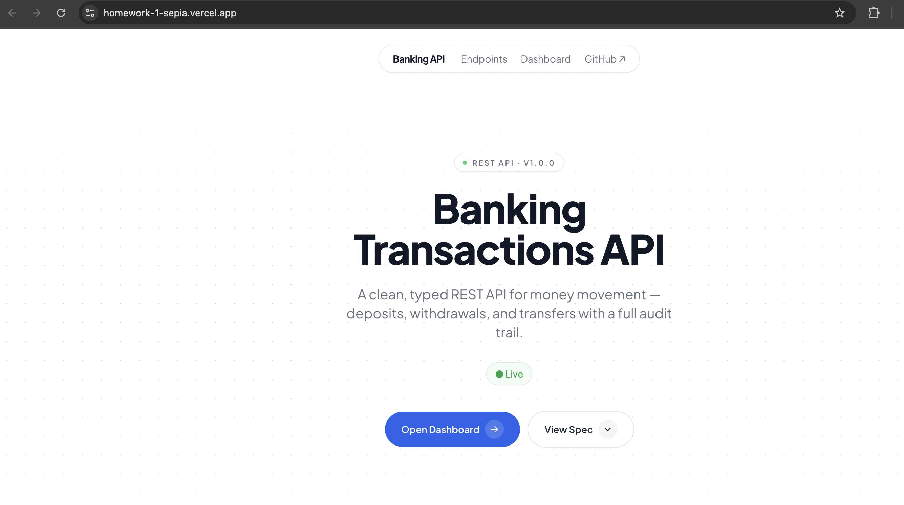
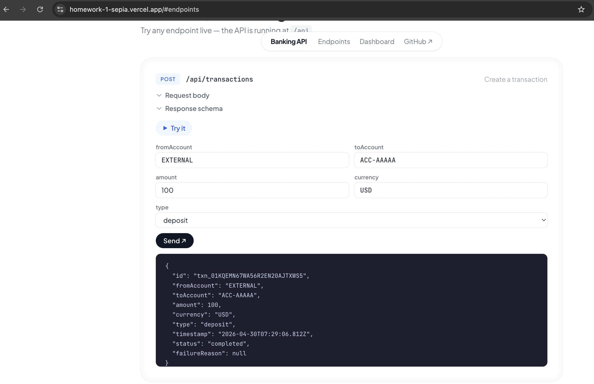
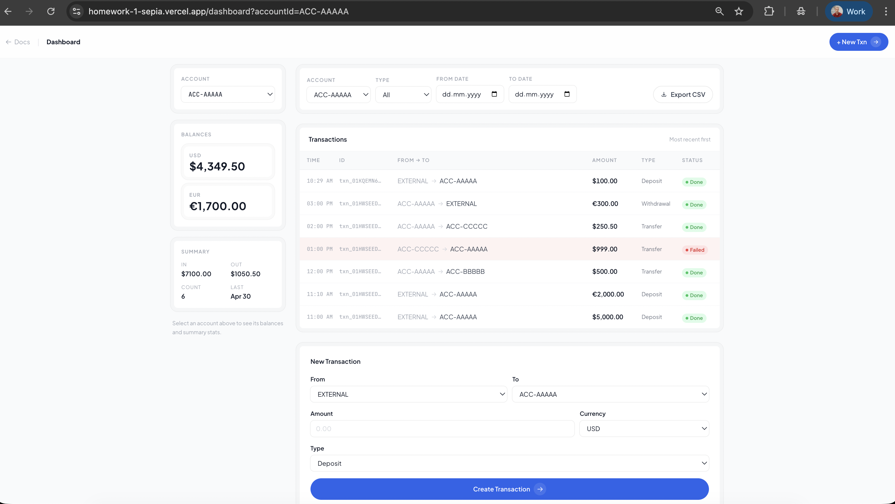
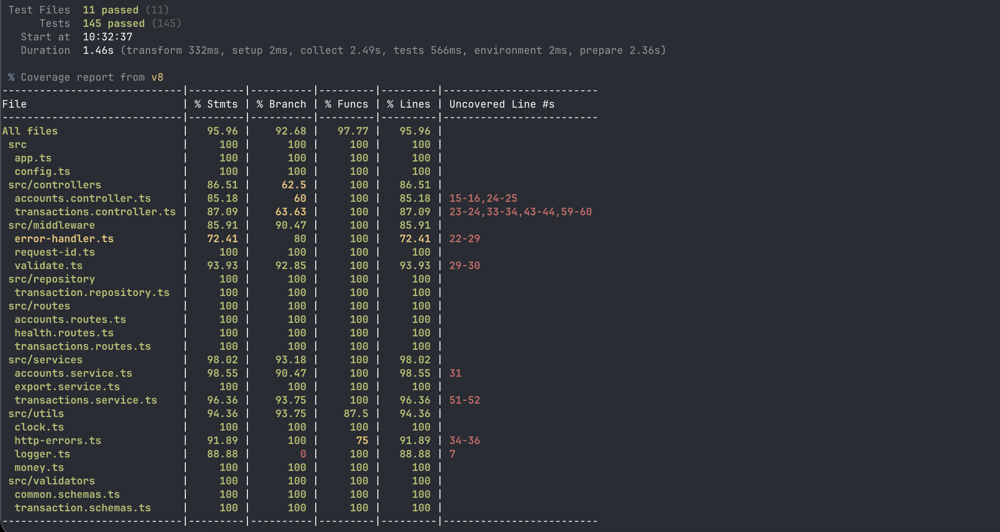
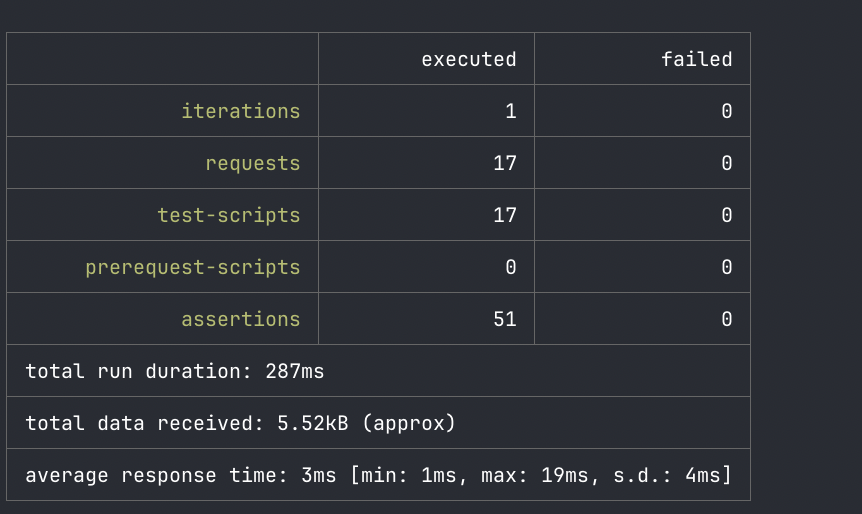
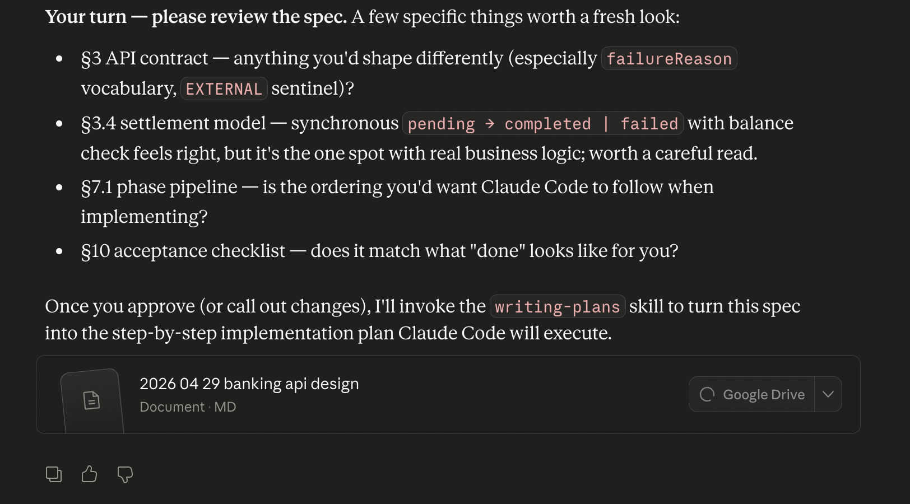
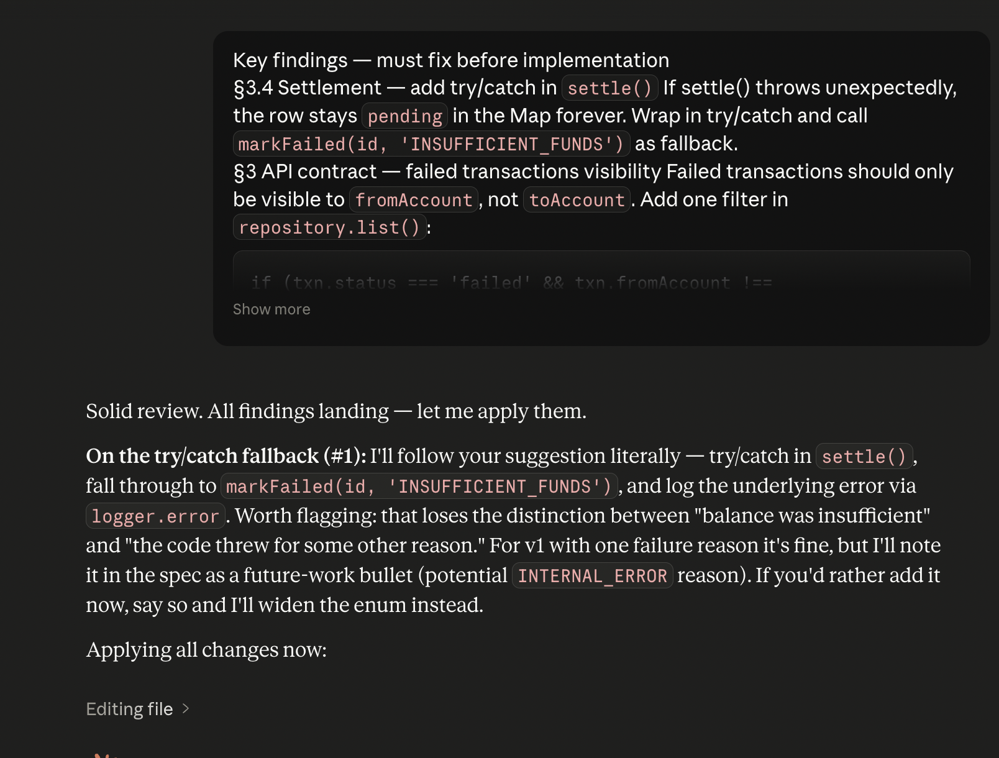
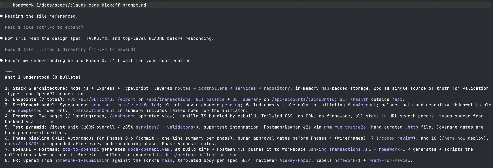

# Banking Transactions API — Homework 1

**Student:** Nick Skrypchenko  
**Course:** GenAI and Agentic AI for Software Engineering  
**Date submitted:** 2026-04-30  
**AI tools used:** Claude Code (claude-sonnet-4-6), Postman MCP

---

## Live deployments

| Environment | URL |
|---|---|
| **Vercel (production)** | https://homework-1-sepia.vercel.app |
| **here.now (static mirror)** | https://hallowed-sonnet-3dak.here.now/ |

The Vercel deployment runs the full Express API as serverless functions with seed data pre-loaded. The here.now deployment is a static frontend only (API calls will return offline).

---

## What was built

A production-flavoured REST API for banking transactions implemented in Node.js + Express + TypeScript, delivered entirely through AI-assisted development. The application handles deposits, withdrawals, and transfers between in-memory accounts, with synchronous settlement, a full audit trail, and a polished static frontend.

### Core features

| Feature | Detail |
|---|---|
| Transaction types | `deposit`, `withdrawal`, `transfer` |
| Settlement | Synchronous — clients never observe `pending`; always `completed` or `failed` |
| Failure mode | `INSUFFICIENT_FUNDS` when balance in the requested currency is insufficient |
| Multi-currency | Balances tracked per-currency; USD withdrawal cannot be paid by EUR balance |
| Visibility filter | Failed transactions are hidden from the counterparty (`toAccount`); visible to initiator and admin |
| CSV export | RFC 4180 compliant, filtered by the same query params as the list endpoint |
| Account balance | Per-currency, completed-only |
| Account summary | Per-currency deposits/withdrawals/count/lastAt, `transactionCount` includes failed rows |
| OpenAPI 3.1 | Generated from Zod schemas via `@asteasolutions/zod-to-openapi` |
| Frontend | Branded landing + API docs page (live Try-it panels), operator dashboard |

### Architecture

```
routes → controllers → services → repository
```

- `TransactionRepository` — sole owner of state, `Map<id, Transaction>` + `byAccount` secondary index
- `TransactionsService` — settlement logic, `getBalance` scoped by currency, circular-dep avoided
- `AccountsService` — read-only aggregations; `transactionCount` includes all, totals only completed
- `ExportService` — RFC 4180 CSV serialisation with field-level quote/escape

### API endpoints

| Method | Path | Description |
|---|---|---|
| `POST` | `/api/transactions` | Create a transaction |
| `GET` | `/api/transactions` | List transactions (with filters) |
| `GET` | `/api/transactions/:id` | Get transaction by ID |
| `GET` | `/api/transactions/export` | Export filtered transactions as CSV |
| `GET` | `/api/accounts/:id/balance` | Per-currency account balance |
| `GET` | `/api/accounts/:id/summary` | Per-currency deposits/withdrawals/count |
| `GET` | `/health` | Health check |

---

## Test coverage

| Layer | Files | Tests |
|---|---|---|
| Unit (services, validators, repo, utils) | 7 files | 104 tests |
| Integration (HTTP via supertest) | 4 files | 41 tests |
| **Total** | **11 files** | **145 tests** |

**Coverage:** 95.96% statements · 92.68% branches · 97.77% functions  
*(thresholds: ≥80% overall, ≥85% services/validators — all exceeded)*

---

## AI usage summary

All implementation phases were driven by Claude Code (`claude-sonnet-4-6`). Full prompt log and decisions documented in [`docs/AI-USAGE.md`](docs/AI-USAGE.md).

| Phase | Tool | Outcome |
|---|---|---|
| 0 — Scaffold | Claude Code | Full folder structure + wiring |
| 1+2 — Backend + HTTP layer | Claude Code | 145 tests, 95.96% coverage |
| 3 — OpenAPI + Postman | Claude Code + Postman MCP | `docs/openapi.yaml` + Newman e2e |
| 4 — Wireframes + design briefs | Claude Code | `docs/specs/wireframes.md`, `visual-brief.md` |
| 5 — Frontend UI | `/high-end-visual-design` skill | Styled landing page + dashboard |
| 7 — Code review | Inline review (skill unavailable) | `docs/reviews/codex-review-2026-04-29.md` |
| 10 — Static deploy | `/here-now` skill | Static frontend live at `hallowed-sonnet-3dak.here.now` |
| 11 — Vercel deploy | `vercel:deploy` skill + Playwright testing | Full-stack deploy at `homework-1-sepia.vercel.app` |
| 12 — Test evidence | Claude Code + Playwright MCP | Screenshots in `docs/screenshots/` |

---

## Screenshots

### Live deployment (Vercel)

| Landing page | Endpoints — live Try-it | Dashboard (ACC-AAAAA) |
|---|---|---|
|  |  |  |

### Test results

| Unit + Integration (Vitest · 145/145) | E2E summary (Newman · 51/51) |
|---|---|
|  |  |

Full coverage report: [`docs/screenshots/coverage-report.png`](docs/screenshots/coverage-report.png)  
Full Newman run: [`docs/screenshots/newman-results.png`](docs/screenshots/newman-results.png)

### AI workflow (Claude Code sessions)

| Spec review | Implementation feedback | Kickoff prompt |
|---|---|---|
|  |  |  |

---

## Known limitations

- **In-memory only** — state is lost on process restart. Seeded data available via `SEED=1`.
- No authentication or authorisation — all accounts are publicly readable.
- No currency conversion — balances are tracked per-currency, not cross-currency.
- `pending` status exists in the domain model (set during repo creation) but is never returned by the API.

---

## Project structure

```
homework-1/
├── src/
│   ├── app.ts                    # Express app factory (testable)
│   ├── index.ts                  # Bootstrap entry point
│   ├── config.ts                 # Env var parsing (Zod)
│   ├── routes/                   # Express routers
│   ├── controllers/              # Thin HTTP handlers
│   ├── services/                 # Business logic (transactions, accounts, export)
│   ├── repository/               # In-memory store + secondary index
│   ├── validators/               # Zod schemas (single source of truth)
│   ├── models/                   # Type aliases from z.infer
│   ├── middleware/               # requestId, validate, errorHandler
│   └── utils/                    # Money, clock, logger, http-errors
├── api/
│   └── index.js                  # Vercel serverless entry point (exports Express app)
├── public/
│   ├── index.html                # Landing + API docs page
│   ├── dashboard/index.html      # Operator dashboard (served at /dashboard/)
│   ├── css/tailwind.css          # Built CSS (committed for zero-build deploy)
│   └── js/                       # TypeScript components + built bundles
├── tests/integration/            # Supertest integration tests
├── demo/
│   ├── postman-collection.json   # Newman e2e collection (17 requests, 51 assertions)
│   └── sample-data.json          # Seed data (10 transactions across 3 accounts)
├── docs/
│   ├── AI-USAGE.md               # Prompt log + decisions per phase
│   ├── openapi.yaml              # OpenAPI 3.1 (generated from Zod schemas)
│   ├── reviews/codex-review-2026-04-29.md
│   ├── screenshots/              # Test evidence + app demos + AI workflow shots
│   └── specs/                    # Design spec, wireframes, visual brief
├── scripts/
│   └── generate-openapi.ts       # OpenAPI generation script
├── Dockerfile
├── vercel.json                   # Vercel deployment config (framework: null, rewrites)
├── README.md
└── HOWTORUN.md
```
