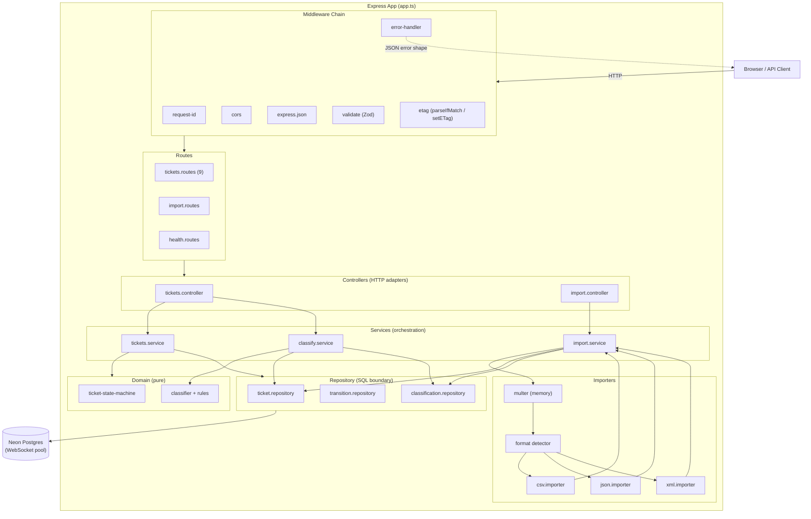
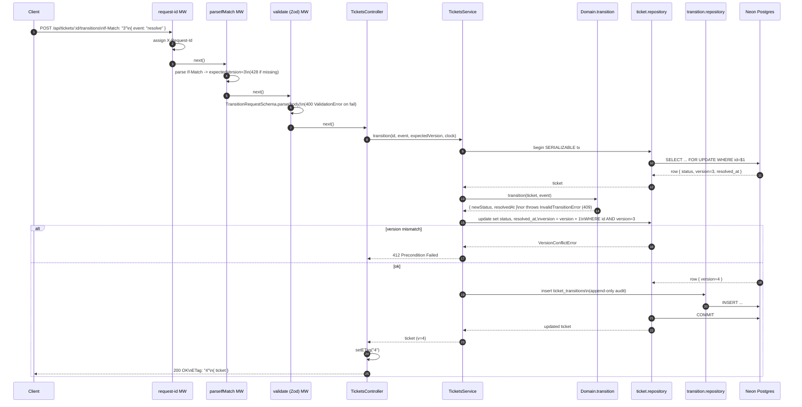

# Architecture

A Customer Support Ticket System exposed as a REST API. Express 4 on Node 20 sits in front of a Neon Postgres database accessed through Drizzle ORM over the neon-serverless WebSocket driver. The system is deployed as Vercel Serverless Functions; a static operator dashboard is served from `/public`. The codebase is layered (middleware -> routes -> controllers -> services -> domain + repository) with strict separation between HTTP concerns, business orchestration, and pure domain logic.

## High-Level Architecture

## Component Descriptions

### Middleware
The middleware layer is intentionally thin and composable. `request-id` stamps every inbound request with an `X-Request-Id` (echoed in responses and error payloads) so a single trace ID flows from edge through logs and back to the client. `validate` is a Zod adapter that runs schema parsing against `body`, `query`, or `params` and throws a typed `ValidationError` on failure -- controllers therefore never see untrusted input. `etag` is split into two pure helpers: `parseIfMatch` enforces the presence and shape of the `If-Match` header (a `428 Precondition Required` is returned when missing, `412 Precondition Failed` on mismatch downstream), and `setETag` writes the integer version back as a quoted ETag. `error-handler` is the single funnel: every typed error from `utils/http-errors.ts` maps to a stable JSON shape (`{ error: { code, message, details?, request_id } }`) with the correct HTTP status. Unknown errors are logged and degraded to a generic 500 -- internals never leak.

### Domain
Domain code is pure TypeScript with no I/O. `ticket-state-machine.ts` exposes an `allowedTransitions` table and a `transition(ticket, event)` function that returns the new status plus the correct `resolved_at` mutation: it is set when the ticket enters `resolved`, cleared when reopening from `resolved` or `closed` back to `in_progress`, and preserved on the `resolved -> closed` step. Any disallowed edge throws `InvalidTransitionError`. The classifier (`classifier.ts` + `classifier-rules.ts`) is a deterministic keyword-scoring engine: it tokenises subject and description, accumulates per-category and per-priority scores from the rule table, and applies a documented tie-breaker (highest score wins; on ties the rule order in `classifier-rules.ts` decides). The function returns `{ category, priority, confidence, matched_rules[] }` so the result is fully auditable.

### Repository
The repository layer is the only place that constructs SQL. `ticket.repository.ts` owns the canonical mutation primitive: a `serializable` transaction that runs `SELECT ... FOR UPDATE`, compares the row's `version` against the caller-supplied expected version, performs the update with `version = version + 1`, and returns the new row. Mismatches raise `VersionConflictError` (mapped to 412). `bulkInsert` opens an outer transaction and wraps each row in a `SAVEPOINT` so a single bad row rolls back to its savepoint without aborting the whole import. `transition.repository.ts` and `classification.repository.ts` are deliberately read-mostly with append-only writes -- they expose `insert*` and `listByTicketId` and never `UPDATE` or `DELETE`. This invariant is what makes the audit story trustworthy.

### Services
Services are the orchestration layer and the only place that composes repository calls with domain functions. `tickets.service.ts` handles the full mutation lifecycle: load expected version from `If-Match`, call the state-machine, persist via repository, append a row to `ticket_transitions` -- all inside the same transaction so the audit trail can never drift from the ticket. `classify.service.ts` runs the classifier against the ticket payload, updates the ticket's category/priority, and writes a `classifications` row in a single transaction. `import.service.ts` glues parsing, per-row Zod validation, `bulkInsert`, and optional auto-classification, then returns a structured report (`{ total, succeeded, failed[], auto_classified }`). Services own all clock reads via the injectable `Clock` interface so transitions and audit timestamps are deterministic in tests.

### Controllers
Controllers are intentionally thin HTTP adapters: extract typed input from `req` (after Zod has already parsed it), call exactly one service method, set `ETag` and `Location` headers where appropriate, and return JSON. They contain no branching on domain state and no SQL. This keeps service-level logic fully testable without `supertest`.

### Importers
Each importer is a single function `parse(buffer): unknown[]` registered in `importers/index.ts` keyed by content type / file extension. `csv.importer.ts` uses `papaparse` with header inference plus an `unflattenRow` helper that turns dotted keys (`metadata.source`) into nested objects so a CSV row matches the same Zod schema as a JSON object. `json.importer.ts` does a raw `JSON.parse` and asserts `Array.isArray` -- nothing more. `xml.importer.ts` uses `fast-xml-parser` with `isArray` hints so single-element collections do not collapse to objects. The format detector picks the importer; the rest of the pipeline is format-agnostic, which is what makes adding a new format a one-file change.

## Data Flow: POST /api/tickets/:id/transitions

## Design Decisions and Trade-Offs

### Rule-based classifier (not LLM)
The classifier is a pure function over a static rule table. Three reasons drove this. First, **determinism**: the same input always yields the same `{category, priority, confidence}`, which is required for the audit log and for reproducible tests. Second, **no external dependency**: there is no API key to manage, no rate limit, no tail-latency from a remote model, and no failure mode where the import pipeline stalls because a third party is down. Third, **explainability**: the classifier returns `matched_rules[]`, so an operator can see exactly why a ticket was tagged "billing/high". The trade-off is recall on novel phrasing; the rule table is intentionally easy to extend, and an LLM-backed classifier could be slotted in behind the same interface later without touching services or repositories.

### Optimistic concurrency (not pessimistic locking)
Mutations require `If-Match: "N"`. The repository runs `SELECT ... FOR UPDATE` inside a serializable transaction only long enough to validate the version and write -- it never holds a row lock across HTTP boundaries. This was a forced choice as much as a design choice: the neon-serverless WebSocket pool used on Vercel has a small per-instance connection budget, so any pattern that holds DB locks while waiting on a client would saturate the pool under modest concurrency. Optimistic locking pushes the conflict back to the client (412 -> re-fetch -> retry), which is correct for a low-contention support workflow where two operators editing the same ticket is rare.

### Append-only audit log
`ticket_transitions` and `classifications` are insert-only by convention and by the absence of any repository UPDATE/DELETE method. This gives an immutable, replayable history of every status change and every classification decision -- critical for compliance and for debugging "why did this ticket end up here". The trade-off is unbounded growth; the tables carry a `created_at` index so retention can be enforced later by a partitioned archive job rather than in-place mutation.

### Per-row SAVEPOINTs in bulkInsert
A bulk import of 10,000 rows where one row has a malformed email should not 500 the whole request. `ticket.repository.bulkInsert` opens a single outer transaction (so the import is atomic at the report level) and wraps each row in `SAVEPOINT row_N`. A failure rolls back to that savepoint and continues; the row is captured in `failed[]` with its row index, error code, and message. This yields partial-success semantics with full per-row error attribution, at the cost of slightly higher transaction overhead than a single multi-row `INSERT`.

### neon-serverless (WebSocket) over neon-http
Drizzle supports both Neon drivers. The HTTP driver is cheaper for simple one-shot queries but does not support multi-statement transactions, `SELECT ... FOR UPDATE`, or `SAVEPOINT` -- all three are required by the optimistic-locking and bulk-import code paths in this repo. The WebSocket driver does, at the cost of holding a pool of WebSocket connections from the serverless function. We accept that cost because it is the only driver that can express the consistency guarantees the system depends on.

## Security Considerations

Validation happens at the HTTP boundary only -- every route runs a Zod schema (`CreateTicketSchema`, `UpdateTicketSchema`, `TransitionRequestSchema`, `ImportQuerySchema`, `TicketMetadataSchema`) before the controller is invoked, so services and repositories operate on already-typed, already-trusted values. Zod failures produce a typed `ValidationError` with field-level details, never a stack trace.

Defence in depth at the database layer: `tickets.email` carries a Postgres `CHECK` constraint with an email regex so a bug in the validation layer cannot persist a malformed address; `tickets.metadata->>source` is constrained against an enum; `classifications.confidence` carries a `CHECK (confidence >= 0 AND confidence <= 1)`; `ticket_transitions` and `classifications` use `ON DELETE CASCADE` so orphaned audit rows are impossible.

The error handler scrubs internals: only typed errors expose their `code`/`message`/`details`; all other errors degrade to a generic 500 with the `request_id` so an operator can correlate logs without leaking stack traces or SQL fragments. Connection strings, JWT secrets, and any value sourced from `config.ts` are never logged. CORS origin is read from configuration (single allowed origin in production, permissive in development) and applied as the first middleware after `request-id`. `multer` is configured with `memoryStorage` and a hard byte limit so an oversized upload is rejected before any importer sees it.

## Performance Notes

`autocannon` against the deployed Vercel function with `c=20` measured roughly **25 RPS for `GET /api/tickets`** and **35 RPS for `POST /api/tickets`**. P50 latency tracks closely with the Neon round-trip rather than CPU on the function -- the function-side work (Zod parse, Drizzle query construction, JSON serialisation) is sub-millisecond, while a single query to Neon over the public internet from the benchmark runner cost ~400 ms RTT. Multiple sequential queries inside a transaction (the optimistic-locking path needs `SELECT FOR UPDATE` + `UPDATE` + `INSERT` audit row) multiply that RTT.

The mitigation path is well understood and does not require code changes: enable the **Neon connection pooler** endpoint, deploy the Vercel function in the **same region as the Neon project**, and the per-request RTT drops by an order of magnitude, which would lift both endpoints into the low-hundreds RPS range at the same concurrency. Within the application, the hot paths already avoid N+1 queries (transitions and classifications are read on-demand, not eagerly joined), `tickets` carries indexes on `(status)`, `(priority)`, `(created_at)`, and `(email)`, and the bulk-import path uses a single transaction so the RTT cost is amortised across all rows rather than paid per row.
