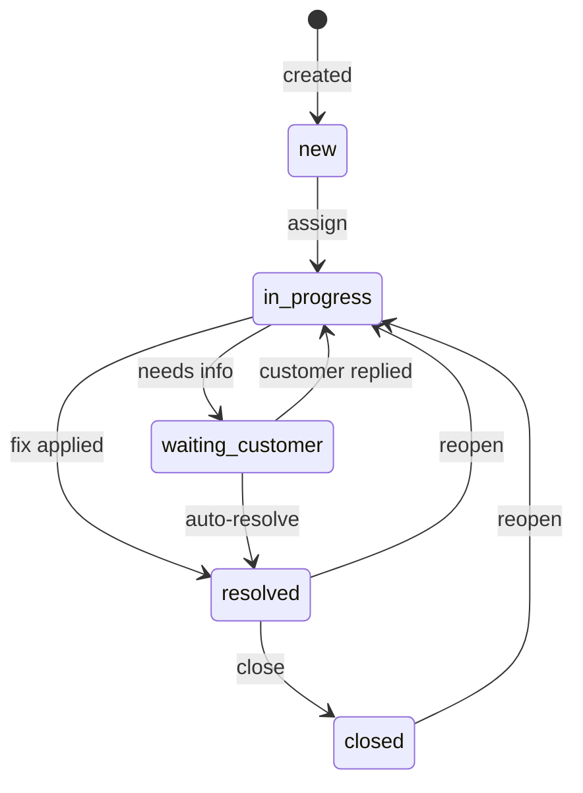

# Customer Support API

A REST API for managing customer support tickets with multi-format bulk import, rule-based auto-classification, optimistic concurrency, and a dark-mode operator dashboard.

**Student:** Nick Skrypchenko  
**AI Tools Used:** Claude Code (claude-sonnet-4-6, claude-opus-4-7), Playwright MCP, autocannon

---

## Features

- Create, read, update, delete tickets with full Zod validation
- Bulk import from CSV, JSON, and XML with per-row error isolation
- Rule-based auto-classification (category + priority + confidence score)
- Optimistic concurrency via ETag / If-Match — no silent overwrites
- Append-only audit log for all status transitions and classification events
- State machine with `resolved_at` semantics (set, cleared, preserved correctly)
- Operator dashboard: filterable table, 3-tab modal, import dropzone

---

## Ticket state machine



---

## Project structure

```
src/
  domain/          pure functions — state machine, classifier
  db/              Drizzle schema + Neon client
  repository/      database access (CRUD, bulk insert, audit reads)
  services/        orchestration — tickets, classify, import
  controllers/     thin HTTP adapters
  routes/          Express route registration
  middleware/      requestId, ETag, Zod validate, error handler
  validators/      Zod schemas (single source of truth)
  importers/       CSV / JSON / XML parsers

public/
  index.html       landing page + API explorer
  dashboard.html   operator dashboard
  js/              TypeScript frontend (esbuild-bundled)
  css/             Tailwind output + custom design system

tests/
  unit/            domain + validator tests (no DB)
  integration/     supertest + live Neon test branch
  fixtures/        CSV / JSON / XML sample files

docs/
  openapi.yaml     OpenAPI 3.1 spec (generated from Zod schemas)
  perf-results/    autocannon raw JSON
  screenshots/     UI screenshots
  AI-USAGE.md      per-phase AI tool log
```

---

## Installation

```bash
# 1. Install dependencies
npm install

# 2. Copy environment templates
cp .env.example .env
cp .env.test.example .env.test

# 3. Fill in DATABASE_URL in both files (Neon connection strings)

# 4. Apply DB migrations
npm run db:migrate

# 5. Seed sample data (optional)
npm run db:seed
```

---

## Running the server

```bash
# Development (ts-node-dev, auto-restart)
npm run dev

# Production build + start
npm run build && npm start
```

Server starts on `http://localhost:3000`.

---

## Running tests

```bash
# Unit tests only (no DB required)
npm run test:unit

# All tests (requires .env.test with Neon test branch)
npm test

# With coverage report
npm run test:coverage
```

Coverage gate: ≥85% statements, ≥75% branches.  
Current: **96.3% statements** across 212 tests.

---

## Building the frontend

```bash
# Bundle TypeScript → public/js/dist/
npm run build:web

# Rebuild Tailwind CSS
npm run build:css
```

---

## API quick reference

| Method | Path | Description |
|--------|------|-------------|
| GET | `/health` | Health check |
| GET | `/api/tickets` | List tickets (filters: status, category, priority, assigned_to, q) |
| POST | `/api/tickets` | Create ticket |
| GET | `/api/tickets/:id` | Get ticket (sets ETag header) |
| PUT | `/api/tickets/:id` | Update ticket (requires If-Match) |
| DELETE | `/api/tickets/:id` | Delete ticket (requires If-Match) |
| POST | `/api/tickets/:id/transitions` | Change status (requires If-Match) |
| POST | `/api/tickets/:id/auto-classify` | Run classifier (requires If-Match) |
| GET | `/api/tickets/:id/transitions` | Transition history |
| GET | `/api/tickets/:id/classifications` | Classification history |
| POST | `/api/tickets/import` | Bulk import CSV/JSON/XML |

All mutating endpoints use optimistic concurrency. Fetch the ticket to get its `ETag`, then pass it as `If-Match: "N"` on the mutation. A version mismatch returns `412 Precondition Failed`.

---

## Environment variables

| Variable | Description |
|----------|-------------|
| `DATABASE_URL` | Neon Postgres connection string (dev) |
| `PORT` | HTTP port (default: 3000) |
| `NODE_ENV` | `development` \| `production` \| `test` |
| `CORS_ORIGIN` | Allowed CORS origin (default: `*`) |

---

## Deployment

The project is configured for Vercel via `vercel.json`. The `api/index.ts` entrypoint wraps the Express app for Vercel's serverless runtime.

```bash
vercel deploy
```

---

## Documentation

| File | Audience |
|------|----------|
| `README.md` | Developers |
| `ARCHITECTURE.md` | Technical leads |
| `API_REFERENCE.md` | API consumers |
| `TESTING_GUIDE.md` | QA engineers |
| `HOWTORUN.md` | Operators / first-time setup |
