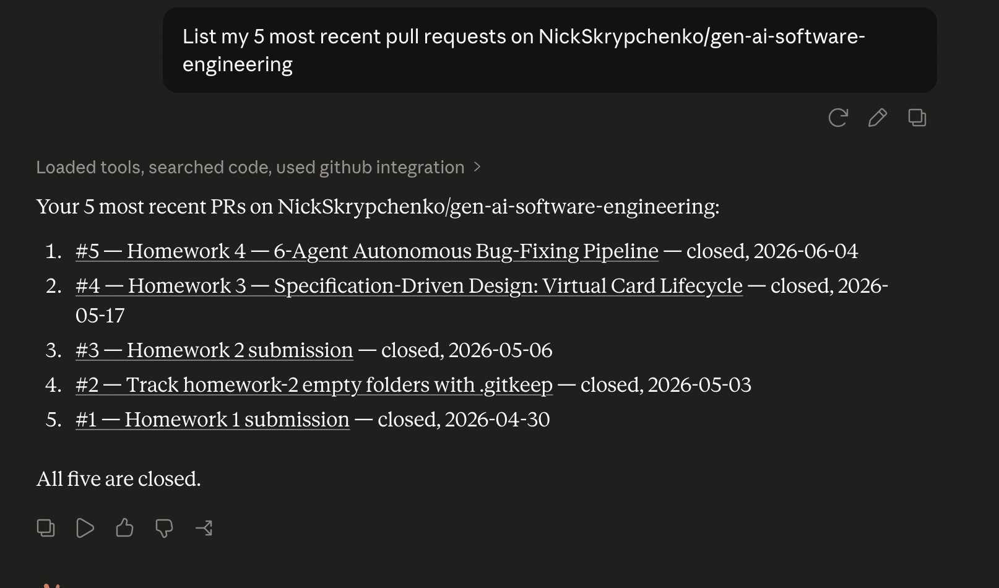
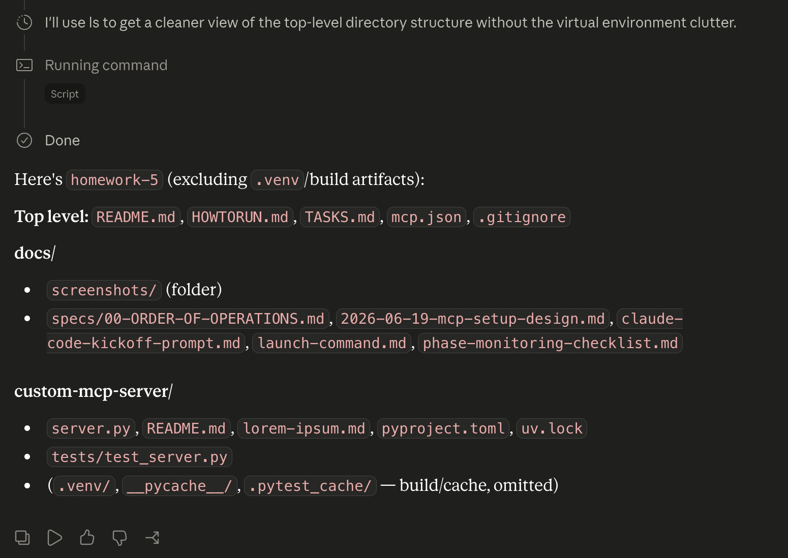
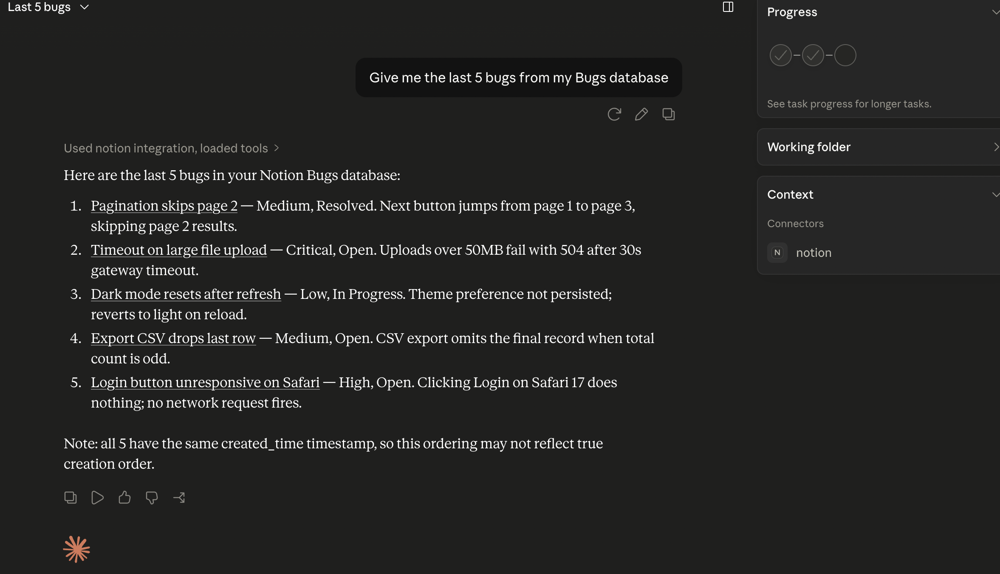
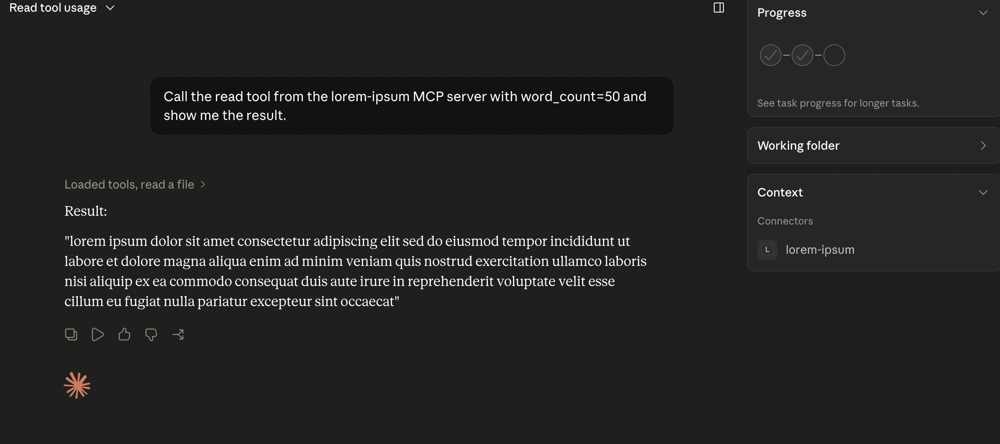

# Homework 5 — MCP Servers Setup & Custom FastMCP Server

**Author:** Nick Skrypchenko

Configure **three external MCP servers** (GitHub, Filesystem, Notion) in Claude Desktop
and build **one custom FastMCP server** that exposes a resource template and a `read`
tool. Each server is demonstrated with a screenshot of a real MCP call.

> Full setup and reproduction steps: [HOWTORUN.md](HOWTORUN.md).
> Design spec: [docs/specs/2026-06-19-mcp-setup-design.md](docs/specs/2026-06-19-mcp-setup-design.md).

---

## MCP primitives (quick reference)

- **Resources** are URIs Claude can *read* from (files, APIs, dynamic content). The custom
  server exposes the resource template `lorem://words/{word_count}`.
- **Tools** are actions Claude can *call* to perform an operation. The custom server
  exposes the `read(word_count=30)` tool.

Both read from `custom-mcp-server/lorem-ipsum.md` and return the first `word_count` words.

---

## Servers

| # | Server | Package | Transport | Auth | Demo prompt | Screenshot |
|---|--------|---------|-----------|------|-------------|------------|
| 1 | **GitHub** | `@modelcontextprotocol/server-github` (community) | stdio (`npx`) | PAT (`repo`, `read:org`) | "List my 5 most recent pull requests on NickSkrypchenko/gen-ai-software-engineering" | [github-mcp-result.png](docs/screenshots/github-mcp-result.png) |
| 2 | **Filesystem** | `@modelcontextprotocol/server-filesystem` (official) | stdio (`npx`) | none (path scope) | "List the files in the homework-5 directory" | [filesystem-mcp-result.png](docs/screenshots/filesystem-mcp-result.png) |
| 3 | **Notion** | `@notionhq/notion-mcp-server` (official) | stdio (`npx`) | integration token | "Give me the last 5 bugs from my Bugs database" | [notion-mcp-result.png](docs/screenshots/notion-mcp-result.png) |
| 4 | **Custom (FastMCP)** | `custom-mcp-server/server.py` | stdio (`uv`) | none | "Call the read tool from the lorem-ipsum MCP server with word_count=50" | [custom-mcp-read-tool-result.png](docs/screenshots/custom-mcp-read-tool-result.png) |

### Why each server

- **GitHub (community npm).** The PAT is explicit in the config, so the homework shows
  "an MCP server configured with credentials" more clearly than the OAuth remote variant.
  Proves: configuration with a secret env var.
- **Filesystem (official npm).** The simplest MCP — no auth, security is the path-scope
  argument. Proves: a path-scoped tool surface and that client wiring works.
- **Notion (official npm).** Integration-token model, and the integration must be
  explicitly connected to the target database. Proves: a two-step auth (token + per-DB
  permission), the real-world friction.
- **Custom (FastMCP).** Smallest meaningful FastMCP example exercising both MCP
  primitives. Proves: resource URIs vs. tools as distinct MCP surfaces.

---

## Custom server

```
custom-mcp-server/
├── server.py          # FastMCP("lorem-ipsum"): resource template + read tool
├── lorem-ipsum.md     # 500-word plain-text source
├── pyproject.toml     # fastmcp dep + pytest dev group
├── uv.lock            # pinned for reproducibility
└── tests/
    └── test_server.py # 5 in-memory FastMCP Client tests
```

Run and test:

```bash
cd custom-mcp-server
uv sync
uv run server.py          # start the server (stdio)
uv run pytest -v          # 5/5 passing
```

---

## Repository layout

```
homework-5/
├── README.md            # this file
├── HOWTORUN.md          # cold-start runbook (tokens, Desktop config, smoke)
├── mcp.json             # Claude Code-format reference config (placeholder env vars)
├── custom-mcp-server/   # the FastMCP server + tests
└── docs/
    ├── AI-USAGE.md      # CMP table, decisions, issues log
    ├── specs/           # design spec + kickoff prompt
    └── screenshots/     # 4 MCP demo screenshots
```

---

## Screenshots

| GitHub | Filesystem |
|---|---|
|  |  |

| Notion | Custom (lorem-ipsum) |
|---|---|
|  |  |
